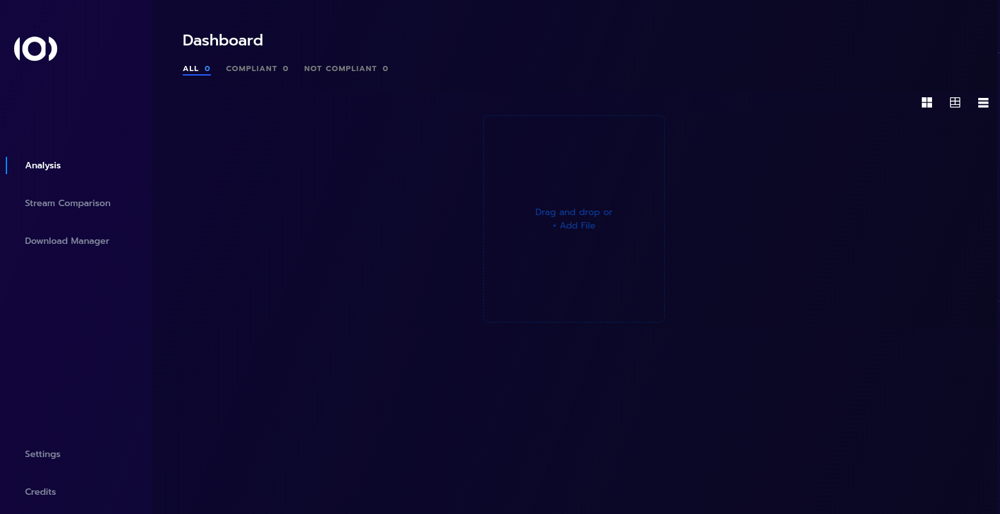

# Live IP Software Toolkit to assist EBU members in the implementation of IP based facilities

LIST is composed by:
- a set of libraries that handle the ST2110 standards suite;
- a browser-based application that analyzes previously captured network packets as pcap files.

## Main Features

| | |
:-------------------------|:-------------------------:
Quickly see if your streams are compliant with ST2110. | 
See each individual stream | 
Analyse PTP | 
Drill drown on each stream and understand the details | 

## Dematerialized version

We deployed an [online version](http://list.ebu.io/) that you can start using right away.

## Your own instance of LIST

* [How to run your instance of LIST](./docs/local_docker.md)

## For developers

* [How to compile LIST](./docs/compiling_list.md)
* [How to further develop LIST](./docs/list_development.md)

## Additional information

* [Explanation of the timing parameters](./docs/parameters_explained.md)
* [Cfull and Vrx analysis](./docs/cfull_and_vrx_analysis.md)
* [Audio timing analysis](./docs/audio_timing_analysis.md)

## License

See [LICENSE](LICENSE.md) for more information.
