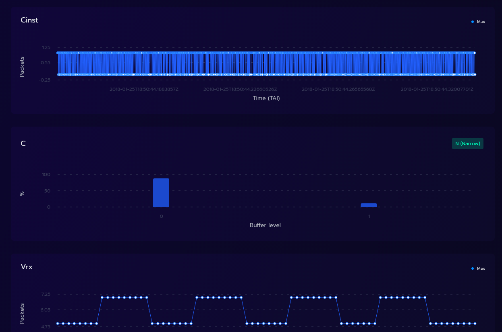

# Project Status: No Longer Actively Maintained
**Important Notice:**

This project is no longer actively maintained. While the code remains available for reference and use, please be aware of the following:
- **Ageing Codebase:** The project may rely on outdated dependencies or practices no longer considered best-in-class.
- **Potential Security Risks:** Due to the lack of ongoing updates, security vulnerabilities could exist or arise over time.
- **Use at Your Own Risk:** We recommend reviewing the code and dependencies carefully before using it in production environments.

We encourage forks and community-driven efforts if you wish to continue development or address potential issues.

Thank you to everyone who contributed, used, and supported this project!

# Live IP Software Toolkit to assist EBU members in the implementation of IP based facilities

LIST is composed by:

-   a set of libraries that handle the ST2110 standards suite;
-   a browser-based application that analyzes previously captured network packets as pcap files.

## Main Features

|                                                        |                                |
| :----------------------------------------------------- | :----------------------------: |
| Quickly see if your streams are compliant with ST2110. |     |
| See each individual stream                             |   |
| Drill drown on each stream and understand the details  |  |

## Dematerialized version

We deployed an [online version](https://list.ebu.io/) that you can start using right away.

## Your own instance of LIST

-   [How to run your instance of LIST](./docs/how-to-install-on-local-docker.md)

## For developers

-   [How to compile LIST](./docs/compiling_guide.md)
-   [How to further develop LIST](./docs/development_guide.md)
-   [Perform validation tests](./docs/validation_tests.md)
-   [Create Read only user](./docs/read_only_user.md)
-   [API documentation](./docs/api.md)

## Additional information

-   [Video timing analysis](./docs/video_timing_analysis.md)
-   [Audio timing analysis](./docs/audio_timing_analysis.md)
-   [Ancillary data](./docs/ancillary_data.md)
-   [Stream compare](./docs/stream_compare.md)
-   [TTML](./docs/ttml.md)

## License

See [LICENSE](LICENSE.md) for more information.
