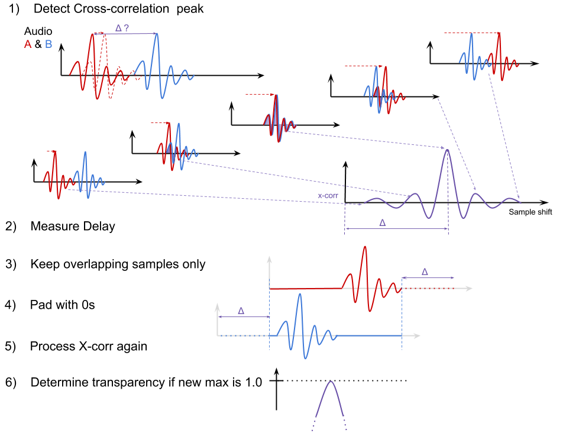

# Audio-to-audio

Analysis relies on [cross-correlation](https://en.wikipedia.org/wiki/File:Comparison_convolution_correlation.svg) performed on single-channel PCM. Therefore the user is required to select the audio channel in addition to pcap and stream.

## Algo

A first cross-correlation gives an accurate relative delay (in samples) but max value is degraded by the non-overlapping samples. In other words, with 2 identical audio signal, the larger the delay is, the less common samples the 2 arrays have and the lower the cross-correlation is. To overcome this limitation, we keep all the common samples, based on measured delay, and put all the others to 0. Then a second pass is performed on these modified arrays to achieve a more accurate transparency test.

## Results in the UI

Intermediate results:

| Parameter | Explanation |
| ------ | ------ |
| *Cross-Correlation Graph* | shows a 400-sample-wide window around the peak |
| *Relative Delay* | sample shift associated to Maximum Cross-Correlation. Value in milliseconds is derived from sampling rate. |

Displayed results:

| Parameter | Explanation |
| ------ | ------ |
| *Maximum Cross-Correlation* | maximum of the cross-correlation array, between [-1, 1], used to determine the transparency (the media is exactly the same) if the peak is above 0.99. |
| *Actual Delay* | = Relative Delay + Capture Delay, like for video, actual delay determines if `main` is later (>0) or earlier (<0) than `reference`. |
| *Capture Delay* | As opposed to video frames, not all the PCM samples are not timestamped. We only export the capture timestamp of the 1st and last packets. The 2 PCM arrays may be not perfectly simualtaneous. The difference between the capture time of the 1st packets of each stream reflects this possible delay. |

## Limitation:

* the nodejs dependencies (abr-xcorr and dsp.js) require 16-bit samples as input.
* in order to keep the measurement accurate, the user must use his judgment to adjust the capture setttings according to the expected result. For instance, the capture duration should be a few seconds if the expected delay is 500ms.

## Todo:

* report the first packet RTP timestamp difference
