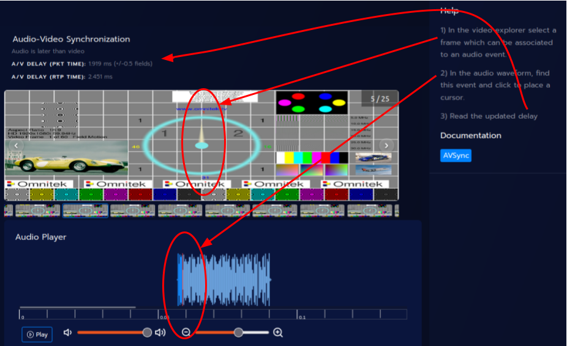

# Audio-Video Synchronization

## Concept

The proposed method allows to quantify the audio-to-video alignement
manually by giving the user the ability to vizualize the decoded frames
and audio waveform side by side and place _time makers_ on it. The delay
is computed in both network domain (packet capture timestamps) and media
domain (RTP timestamps).

## Instructions

-   Setup a test pattern generator in physical space or in the network.
    The media should consist of identifiable video events synced with
    audio events like a clap or a dedicated pattern.
-   Capture both audio and video simultaneously and analyze in LIST
-   In `Compare streams` page:
    -   select the capture file
    -   select either video or audio a `reference`
    -   select the other one as `main`
    -   name the analysis, exple `AV something`
    -   press `Compare`

-   Then interpret the results

| Results                   | Description                                                                                                                                                                           |
| ------------------------- | ------------------------------------------------------------------------------------------------------------------------------------------------------------------------------------- |
| _AV Delay (capture time)_ | This is diff between _audio time marker_ and _video time marker_. Precision of +/-0.5 field/frame is due the unability to accuratly date natural a event captured by a camera sensor. |
| _AV Delay (RTP time)_     | Same but calculated from _RTP time markers_                                                                                                                                           |

## Under the hood

-   On frame selection, the _video capture time marker_ corresponds to the capture timestamp
    of 1st the packet of the frame/field. This works perfectly for a
    pattern generator, but not 100% accurate for natural feed.
-   On audio cursor moved, the _audio capture time marker_ is computed from the
    the new cursor position on the waveform (relative time) offset by the
    capture timestamps of the 1st packet of audio stream.
-   For both audio and video, _RTP time marker_ = _capture time marker_ - _pkt_time_vs_rtp_time_
    (from influxDB).
