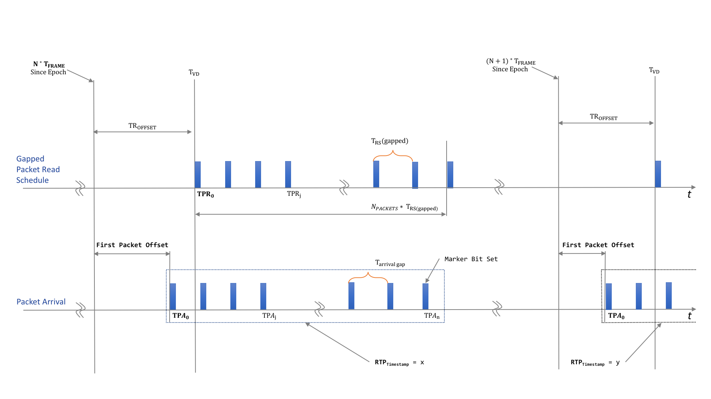

# Parameters Explained

## SMPTE ST 2110-21

| Parameter | Explanation |
| ------ | ------ |
| CINST  | This parameter indicates the instantaneous value of the network compatibility model C as defined in SMPTE ST 2110-21 |
| CMAX | This parameter indicates the maximum allowed value that CINST shall not exceed. This value is dependend on the type of sender, the video format and the packing of the video. A narrow sender has a tighter packet pacing on the network and will have a lower allowed CMAX value than a wide sender. Both sender type are limited in their burstiness. |
| VRX | This parameter indiactes the measured level of the virtual receive buffer, VRX as defined in SMPTE ST 2110-21 |
| VRXFull |  This parameter indicates the maximum allowed value the VRX buffer. This value is dependend on the type of sender, the video format and the packing of the video. A narrow sender has a smaller receiving buffer and will have a lower allowed VRXFull value than a wide sender. Both sender type are limited in their burstiness. |
| TRODefault | This value indicates the default offset between N*Tframe and the first packet of a field or frame to be read. |
| TP<i>A</i>0 | This parameter gives the actual time a packet arrives. The index indicates the first packet of a field or frame. |
| FPO | First Packet Offset is a calculated value for each field or frame and it calculated as follows: TP<i>A</i>0 - N * TFRAME. In theory this value is exact the same value as TRODefault. In practise this value will be a bit smaller, as a result of this difference some packets will be sinked into the VRX buffer.|
| Margin | TP<i>A</i>0 - TP<i>R</i>0 |

## RTP Timestamps

| Parameter | Explanation |
| ------ | ------ |
| RTPTime2Reference | RTPTime2Reference = RTPTimestamp - N*Tframe |
| RTPTime2TP<i>A</i>0| RTPTime2TP<i>A</i>0 = RTPTimestamp - TP<i>A</i>0 |

