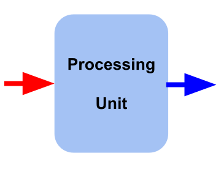
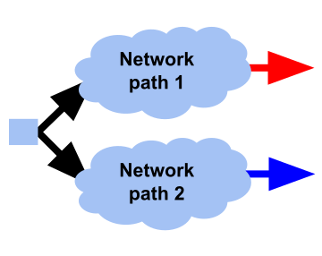
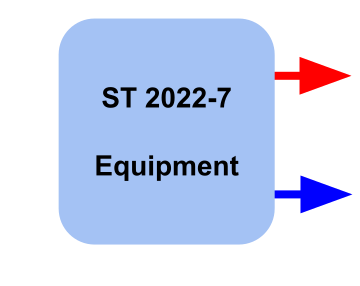
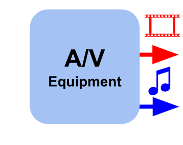

# Stream compare

The idea consists in comparing 2 streams captured simultaneously (usually from the the pcap) by detecting content mismatch or measuring the delay, depending the use case.

## Use cases

| | |
| - | - |
| A) Quantify the delay and the possible differences between 2 streams of same essence. | B) Compare 2 media streams derived from the same initial stream. |
|  |  |
| B) Validate the *network redundancy* (ST 2022-7) | D) Measure the *audio-video synchronicity* for eventual re-alignment |
|  |  |

## A) B) (Differential) media transit and transparency

The 2 streams reflects the same content but at 2 different `logical points` of the network, i.e. multicast groups.
This type of inter-stream analysis aims at measuring the *propagation delay through the network path* and determine the *transparency of a processing chain*.
Regarless of the media type, the algorithm compares 2 extracted payloads: the `reference`, which is most likely the earliest with the `main` (terminology inspired by ffmpeg).
Since RTP timestamp can be overwritten by any processing equipment, it doesn't provide a reliable measurement reference and a media-content-based* analysis is preferred.

[Video-to-video: PSNR](./v2v_comparison.md)

[Audio-to-audio: cross-correlation](./a2a_comparison.md)

Ancillary is not supported yet.

## C) Network Redundancy test

[SMPTE ST 2022-7](./ST_2022-7.md)

## D) A/V synchronicity

[Audio-to-video: manual sync measurement](./a2v_sync.md)
