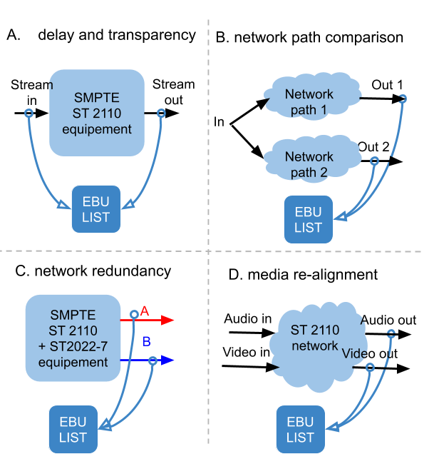

# Stream compare

## Use cases

* get a sense the evolution of a media across a production pipeline by comparing 2 streams, e.g. the input and the output of a processing unit
* validate the network redundancy (ST 2022-7)
* measure the inter-essence synchronicity for eventual re-alignment

## Media-based analysis

The idea consists in probing and comparing 2 streams reflecting the same content but at 2 different `logical points` of the network, i.e. multicast groups.
This type of inter-stream analysis aims at measuring the *propagation delay through the network path* and determine the *transparency of a processing chain*.
Regarless of the media type, the algorithm takes as input 2 extracted paloads: the `reference`, which is most likely the earliest and the `main` (terminology inspired by ffmpeg).
Since RTP timestamp can be overwritten by any processing equipment, it doesn't provide a reliable measurement reference and *media-content-based* analysis is preferred.

[Video-to-video: PSNR](./v2v_comparison.md)

[Audio-to-audio: cross-correlation](./a2a_comparison.md)

## Redundancy test

[SMPTE ST 2022-7](./ST_2022-7.md)

## Media re-alignement

TODO
