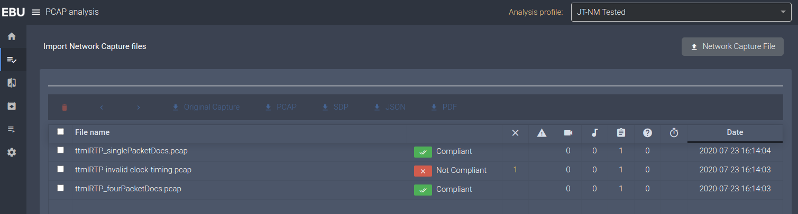
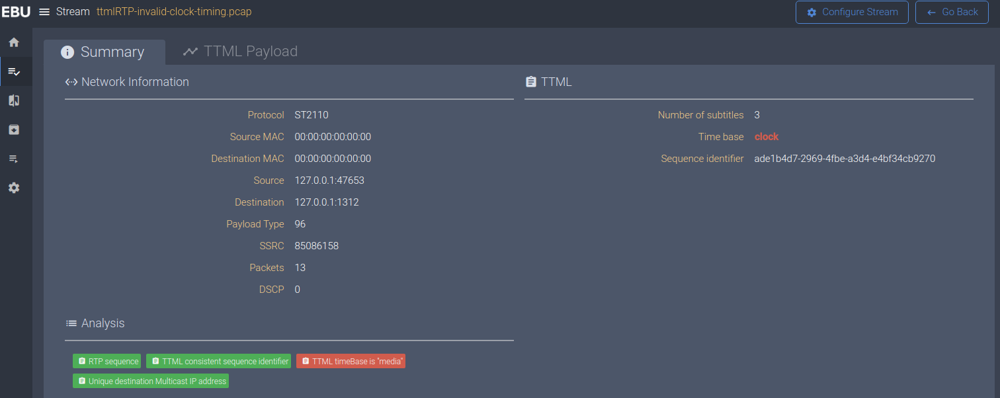
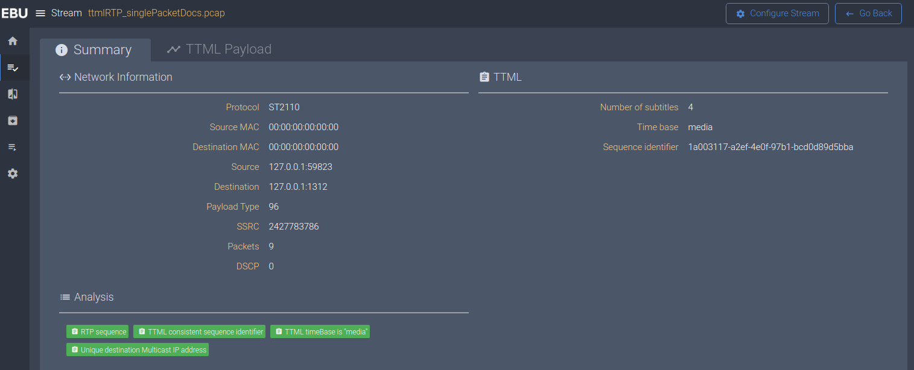
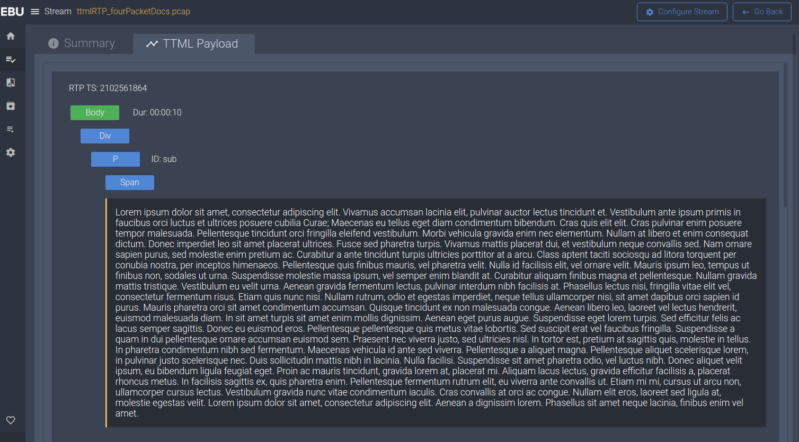

# Analysis of TTML streams

The EBU-TT Live specification (EBU Tech 3370, https://tech.ebu.ch/publications/tech3370) is (the only) modern, standardized format for creating and contributing subtitles in a (distributed) production facility.

The [IETF RFC 8759 RTP Payload for Timed Text Markup Language (TTML)](https://tools.ietf.org/html/rfc8759) describes how to map TTML subtitles (including EBU-TT Live) into RTP. This RFC is based on a proposal submitted to the IETF by the BBC, with the goal of enabling the use of TTML-based subtitles in Live IP environments.

In order for EBU Members and other professional users to be able to verify the presence and correctness of subtitles carried in RTP in IP Live production set ups, EBU LIST integrates a TTML analysis module.

## How to use it

The procedure is the same as for any other kind of stream: drag and drop a pcap file into LIST and it will analyse its contents.

## Validations

LIST will validate the RTP parameters of the TTML stream, as well as the validity of several parameters according to the relevant specifications. LIST will verify if the time base is 'media' and it will check if the sequence identifier is consistent throughout the stream. In case they are not, LIST will signal an error.

## Examples

1 - Summary of the analysis of three pcap file, each containing one TTML stream:
- single packet documents
- multiple packet documents
- invalid timing

2 - The summary of the analysis of one stream with an invalid time base

3 - The summary of the successful analysis of one stream

4 - An example of TTML payload decoding

## Limitations

LIST does not allow the user to link a pcap to the corresponding SDP file. Therefore, some validations are limited or they cannot be performed at all.

* LIST always assumes that streams are EBU-TT-Live, so it always checks the consistency of the  'ebuttp:sequenceIdentifier' element.

* the “codecs" media type parameter is obviously not checked, as it should be present on the SDP only.

* the RTP TS is not decoded to an actual time since that would require information about the rate, which is only present on the SDP.

## Acknowledgments

This work has been done with close collaboration with the BBC.
