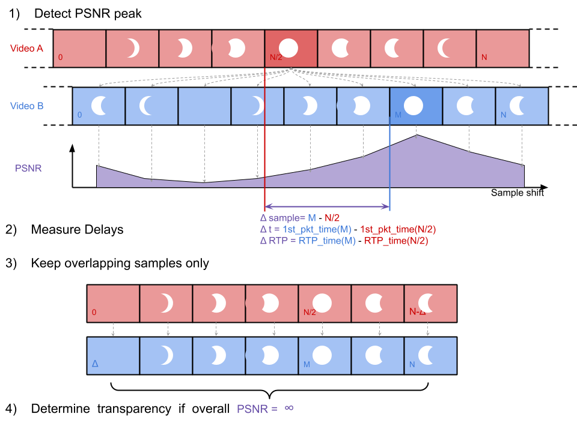

# Video-to-video

## Algo

The algorithm is composed of 2 steps:

* search for the time shift that gives the PSNR peak:
    - select the frame/field in middle of the `reference` video sequence
    - search for the frame/field in `main` which resembles the most to `reference` frame, i.e. giving the maximum PSNR value
    - calculate the `index delta` between the `reference` and `main` frames/fields and derive delays
* refine the peak value
    - previous PSNR calculation based on one-to-one frame comparison isn't accurate enough and needs to be refined by extending the calculation to video sequences
    - discard 1st and last frames/fields in both streams because they're probably incomplete
    - keep the common portion of content shared by the 2 streams, derived from `index delta`
    - recalculate the PSNR over these 2 stripped sequences
    - replace the peak value in PSNR graph (hackish)

## Results in the UI

| Parameter | Explanation |
| ------ | ------ |
| *Maximum of PSNR* | the maximum of the PSNR between the `ref` frame/field and every frame/field of the `main` sequence |
| *Actual delay* | the difference between the capture timestamps of the `ref` frame/field and the most similar `main` frame/field |
| *Media delay* | actual delay converted in media units |
| *RTP delay* | the difference between the RTP timestamps of the `ref` frame/field and the most similar `main` frame/field |

## Notes

* positive values means `main` is later than `reference`
* ffmpeg returns `inf` value for perfectly equal images. This is associated to value `100` in graphes
* if video is interlace, then PSNR operation is performed on fields
* the scan type of both `main` and `reference` stream must be the same type

## Limitations

* decoded frames/fields are .PNG files so pixels are 8-bit per color channel instead of the initial 10-bit
