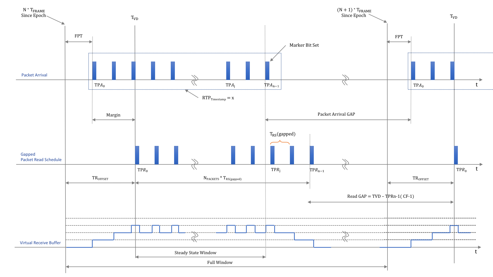

# Video Parameters Explained

## SMPTE ST 2110-21

### Basic definitions

| Parameter | Explanation |
| ------ | ------ |
| Tframe | Frame/field period |
| N | Frame or field index since the SMPTE epoch |
| N x Tframe | Frame/field reference time |
| TP<i>R</i>j | Ideal time when a packet j gets out off the receive buffer in the Read Schedule model |
| TVD |  Video Transmission Datum: TP<i>R</i>0 = TVD |
| TP<i>A</i>j | Actual measured arrival time of a packet |

### Results

| Parameter | Explanation |
| ------ | ------ |
| CINST  | Instantaneous value of the *Retwork Compatibility model* C as defined in SMPTE ST 2110-21 |
| CMAX | Maximum allowed value that CINST shall not exceed. This value is dependend on the type of sender, the video format and the packing of the video. A narrow sender has a tighter packet pacing on the network and will have a lower allowed CMAX value than a wide sender. Both sender type are limited in their burstiness. |
| VRX | Measured level of the *Virtual Receive Buffer* as defined in SMPTE ST 2110-21 |
| VRXFULL | Maximum allowed value the VRX buffer. This value is dependend on the type of sender, the video format and the packing of the video. A narrow sender has a smaller receiving buffer and will have a lower allowed VRXFull value than a wide sender. Both sender type are limited in their burstiness. |
| FPT | First Packet Time measured between frame/field reference time and the first *captured* packet of a field/frame. This is a like a measured TRoffset supposedly close to TROdefault. In practise this value will be a bit smaller, as a result of this difference some packets will be sinked into the VRX buffer. |
| TROdefault | Default *theoretical* offset between the frame/field reference time and the first packet of a field or frame to be *read*. |
|TCF| Time of the current frame: TCF = N x TFRAME|

## Analysis method

### Requirements

- *Accuracy*: The clock of the capture device must be locked to the same PTP master as the sender device. Experience has often shown the opposite. We use algorithms that try to minimize the impact of a non-locked capture or sender device. However, the results are not guaranteed to be accurate.
- *Precision*: The capture must be done using nanosecond resolution pcap files.

### Assumptions

- *Schedule*: LIST does not rely on SDP files, therefore it is doesn't know if the schedule is gapped or linear. Therefore, we use an heuristic to determine that. That heuristic is based on the gap between the capture time of the last packet of one frame and the first packet of the subsequent frame. If that gap is at least 10 times the inter packet spacing of all other packets, we assume the schedule is gapped.
- *VRX buffer* should be empty at the begin of each frame. This is not necessarily correct and we may eventually remove this constraint. (see https://github.com/ebu/pi-list/issues/18)
- Packets are processed in their *arrival order* for CINT and VRX. Packet shuffling (RTP sequence numbers) is ignored.

### VRX

- We don't adjust the VRX meassurement to the TRoffset value that might be announced in the SDP file.

- *Ideal*:  TRoffset = TROdefault = TVD - N x Tframe

## RTP Timestamps

| Parameter | Explanation |
| ------ | ------ |
RTPOFFSET|This measurement is the difference between the time encoded in the RTP timestamp and the epoch-aligned start of the frame period. 
RTPOFFSET = RTPTimestamp - N x Tframe  
The RTPOFFSET measurement is affected by: PTP lock and Phase Offset and of the Sender and the Test Receiver Relationship of the underlying RTP Clock to PTP (is the signal locked to PTP) 
The PTP time of the RTP is limited by the resolution of the 90 kHz RTP Clock, which has quantization of 11µs.  The true PTP time of when a packet is assembled in the sender output buffer will be somewhere within this 11µs RTP window. So even in a perfect system, the measurements will have a tolerance of 11 µs.
| FPT | First Packet Time = TP<i>A</i>0 - RTPTimestamp 
Acceptable range is given by [JT-NM Tested Program](http://jt-nm.org/documents/JT-NM_Tested_Catalog_ST2110_Full-Online-2019-09-10.pdf) Section 5.3: "The instantaneous value of the RTP timestamp of the stream is not in the future, not more than 1 ms in the past (unless justified), and preserve a stable relation to the PTP" |
| | |

